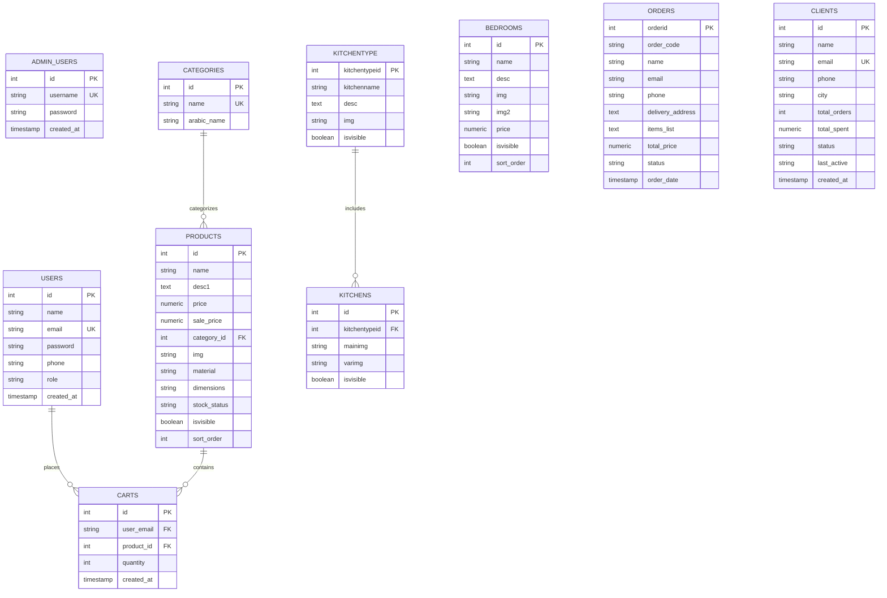

# 🏛️ Hurfa Studio — REST API Backend Server

A robust, scalable, and modular **REST API Backend Server** for the **Hurfa Architectural Studio & Bespoke Furniture** platform. Built with **Node.js**, **Express.js (ES Modules)**, and **PostgreSQL**, following the layered architecture, clean code principles, and full-stack patterns established in `25-26-summer-fullstack`.

---

## 📑 Table of Contents
1. [Architectural Overview](#architectural-overview)
2. [Web Request-Response Cycle (WRRC)](#web-request-response-cycle-wrrc)
3. [Database Entity Relationship Diagram (ERD)](#database-entity-relationship-diagram-erd)
4. [Project Structure & Separation of Concerns](#project-structure--separation-of-concerns)
5. [Authentication & Authorization](#authentication--authorization)
6. [API Endpoints Reference](#api-endpoints-reference)
7. [Installation & Setup](#installation--setup)
8. [Database Seeding](#database-seeding)
9. [Running the Application](#running-the-application)
10. [Environment Variables](#environment-variables)
11. [Testing Endpoints with cURL](#testing-endpoints-with-curl)

---

## 🏗️ Architectural Overview

The Hurfa backend server is architected following industry-standard **Separation of Concerns (SoC)** and **DRY (Don't Repeat Yourself)** principles:

- **Runtime & Syntax:** Node.js (v20+) with native ECMAScript Modules (`"type": "module"`).
- **Web Framework:** Express.js (v4.21+), managing routing, middleware pipelines, and error handling.
- **Relational Database:** PostgreSQL (v14+ / v16+) with native `pg` client connection pooling and parameterized queries (`$1`, `$2`) to prevent SQL injection vulnerabilities.
- **Security & Middlewares:** 
  - `cors`: Cross-Origin Resource Sharing for seamless frontend integration with `Hurfa_Website-Client`.
  - `morgan`: HTTP request logging for development and audit trails.
  - `bcryptjs`: Industry-standard salted cryptographic hashing for passwords.
  - `adminAuth`: Role-based middleware enforcing administrative restrictions (`x-role: admin`).
  - `errorHandler`: Centralized error handling catching unhandled exceptions and returning standard JSON payloads.

---

## 🔄 Web Request-Response Cycle (WRRC)

The Web Request-Response Cycle describes the complete life cycle of an HTTP communication between the client (React application) and the backend server:

```
+-------------------------------------------------------------------------------+
|                       WEB REQUEST-RESPONSE CYCLE (WRRC)                       |
+-------------------------------------------------------------------------------+

 [ React Client ]  (Hurfa_Website-Client: Vite / React 19 / Bootstrap)
       │
       │  1. HTTP Request (Method: GET/POST/PUT/DELETE, URL, Headers: x-role, JSON Body)
       ▼
 [ Express Server ]  (Hurfa_Website-Server : PORT 5000)
       │
       ├─► 2. Global Middlewares:
       │     ├─ CORS Middleware (Headers validation & origin allow)
       │     ├─ JSON Parser (`express.json()` -> parses incoming request body)
       │     └─ Morgan Logger (Console logging for monitoring)
       │
       ├─► 3. Route Dispatcher (`/api/auth`, `/api/products`, `/api/orders`, etc.)
       │
       ├─► 4. Security / Role Interceptor (`adminAuth` / `auth` middleware)
       │     └─ Checks headers (`x-role: admin`) -> Rejects 403 Forbidden if unauthorized
       │
       ├─► 5. Controller / Route Handler (Business logic & Parameter validation)
       │
       ▼  6. Parameterized SQL Query (`$1, $2`)
 [ PostgreSQL Database ]  (`Hurfa_Website-Database`)
       │
       ▲  7. Query Result Set (Rows / Records)
       │
       ├─► 8. Data Formatting & Serialization (JOD formatting, images array mapping)
       │
       ├─► 9. Centralized Error Handler (Triggered if exceptions occur -> Clean JSON response)
       │
       ▼  10. HTTP Response (Status: 200/201/400/401/403/404/500, JSON Payload)
 [ React Client ]  (Updates React State / UI Components / Session Storage)
```

---

## 🗄️ Database Entity Relationship Diagram (ERD)



---

## 📁 Project Structure & Separation of Concerns

```
Hurfa_Website-Server/
├── db.js                      # PostgreSQL client initialization & connection logic
├── db/
│   └── db.js                  # Modular db re-export
├── middleware/
│   ├── adminAuth.js           # Role-based access control middleware (x-role: admin)
│   ├── auth.js                # User authentication & token/header resolver
│   └── errorHandler.js        # Global error interceptor & JSON formatter
├── routes/
│   ├── auth.js                # User & Admin authentication (/api/auth)
│   ├── products.js            # Furniture products CRUD & catalog search (/api/products)
│   ├── catalog.js             # Studio dashboard catalog & KPI stats (/api/catalog)
│   ├── kitchens.js            # Kitchen collections & variation models (/api/kitchens)
│   ├── bedrooms.js            # Bedroom collection suites & pieces (/api/bedrooms)
│   ├── orders.js              # Order placement & status lifecycle (/api/orders)
│   ├── clients.js             # Studio CRM client & patron roster (/api/clients)
│   ├── users.js               # User accounts & persistent shopping cart (/api/users)
│   └── categories.js          # Product categories list (/api/categories)
├── scripts/
│   └── seed.js                # Database migration, table initialization, and seeding script
├── .env                       # Local environment variables
├── .env.example               # Environment variables template
├── .gitignore                 # Git ignore rules
├── package.json               # Package configuration, dependencies, and scripts
├── schema.sql                 # PostgreSQL DDL schema and initial seed inserts
├── server.js                  # Express application root & HTTP server entry point
└── README.md                  # Comprehensive server documentation
```

---

## 🔐 Authentication & Authorization

The server implements **multi-tier authentication & role-based authorization**:

1. **Customer Accounts (`role: 'customer'`):**
   - Can register via `POST /api/auth/signup`.
   - Can log in via `POST /api/auth/login`.
   - Can manage their persistent shopping cart via `POST /api/users/cart`, `GET /api/users/cart/:email`, `DELETE /api/users/cart/:email/:productId`.
   - Can place orders & consultation requests via `POST /api/orders`.

2. **Studio Administrators (`role: 'admin'`):**
   - Verified through the `adminAuth` middleware.
   - Requires `x-role: admin` header or session authenticated user role.
   - Granted full CRUD access to add, edit, or delete catalog items (`POST /api/products`, `PUT /api/products/:id`, `DELETE /api/products/:id`).
   - Granted permission to update order fulfillment statuses (`PUT /api/orders/:id/status`).
   - Granted access to modify patron accounts and studio KPIs (`/api/catalog/stats`).

---

## 📡 API Endpoints Reference

### 1. Authentication (`/api/auth`)
| Method | Endpoint | Description | Access |
|---|---|---|---|
| `POST` | `/api/auth/signup` | Register new customer or admin account | Public |
| `POST` | `/api/auth/login` | Authenticate user credentials & return profile | Public |
| `GET` | `/api/auth/me` | Fetch authenticated user profile | Authenticated |

#### Sample Request (`POST /api/auth/login`):
```json
{
  "email": "admin@hurfa.com",
  "password": "password"
}
```

#### Sample Response (`200 OK`):
```json
{
  "success": true,
  "message": "Authentication successful.",
  "user": {
    "id": 1,
    "name": "Studio Administrator",
    "email": "admin@hurfa.com",
    "phone": "+962 7 9000 0000",
    "role": "admin"
  }
}
```

---

### 2. Products & Inventory (`/api/products`)
| Method | Endpoint | Description | Access |
|---|---|---|---|
| `GET` | `/api/products` | Get products (supports `?category=`, `?search=`, `?sort=`) | Public |
| `GET` | `/api/products/:id` | Get single product details by ID | Public |
| `POST` | `/api/products` | Create a new piece in inventory | **Admin Only** |
| `PUT` | `/api/products/:id` | Update product specifications, pricing, image | **Admin Only** |
| `DELETE` | `/api/products/:id` | Remove product from inventory | **Admin Only** |

#### Sample Request (`POST /api/products` — Header: `x-role: admin`):
```json
{
  "name": "Wesal Bed Frame",
  "category": "Bedrooms",
  "price": 310,
  "desc": "Upholstered headboard with a low-profile walnut frame.",
  "material": "Natural Walnut & Linen Upholstery",
  "dimensions": "200cm x 180cm x 110cm",
  "stockStatus": "Active",
  "image": "https://ik.imagekit.io/6dghafkgmq/hurfa_catalog/Wesal-Collection_n299cVlM5.jpg"
}
```

---

### 3. Kitchens Showcase (`/api/kitchens`)
| Method | Endpoint | Description | Access |
|---|---|---|---|
| `GET` | `/api/kitchens` | Get all architectural kitchen models with full media & variations | Public |
| `GET` | `/api/kitchens/types` | Get kitchen types from database | Public |
| `GET` | `/api/kitchens/:id` | Get single model by slug (`chic`, `organic`, `contemporary`) or ID | Public |
| `POST` | `/api/kitchens` | Add new kitchen model | **Admin Only** |
| `PUT` | `/api/kitchens/:id` | Update kitchen model | **Admin Only** |
| `DELETE` | `/api/kitchens/:id` | Delete kitchen model | **Admin Only** |

---

### 4. Bedroom Collections (`/api/bedrooms`)
| Method | Endpoint | Description | Access |
|---|---|---|---|
| `GET` | `/api/bedrooms` | Get all bedroom collection pieces | Public |
| `GET` | `/api/bedrooms/:id` | Get single bedroom piece by ID | Public |
| `POST` | `/api/bedrooms` | Create bedroom piece | **Admin Only** |
| `PUT` | `/api/bedrooms/:id` | Update bedroom piece | **Admin Only** |
| `DELETE` | `/api/bedrooms/:id` | Delete bedroom piece | **Admin Only** |

---

### 5. Orders & Consultations (`/api/orders`)
| Method | Endpoint | Description | Access |
|---|---|---|---|
| `GET` | `/api/orders` | List customer orders (supports `?status=`, `?search=`) | Public / Admin |
| `GET` | `/api/orders/:id` | Get single order by order code or numeric ID | Public / Admin |
| `POST` | `/api/orders` | Place new order or request consultation | Public |
| `PUT` | `/api/orders/:id/status` | Update fulfillment status (`In Production`, `Delivered`, etc.) | Public / Admin |
| `DELETE` | `/api/orders/:id` | Delete order record | **Admin Only** |

#### Sample Request (`POST /api/orders`):
```json
{
  "clientName": "Sarah Al-Ahmad",
  "clientEmail": "sarah@example.com",
  "clientPhone": "+962 7 9111 2222",
  "deliveryAddress": "Abdoun, Amman",
  "items": "Tayf Kitchen Set, Kitchen Island V4",
  "total": 3430
}
```

---

### 6. Studio Clients & CRM (`/api/clients`)
| Method | Endpoint | Description | Access |
|---|---|---|---|
| `GET` | `/api/clients` | List all studio patrons and VIP clients | Public / Admin |
| `GET` | `/api/clients/:id` | Get single client profile | Public / Admin |
| `POST` | `/api/clients` | Add client to studio roster | Public / Admin |
| `PUT` | `/api/clients/:id` | Update client details | Public / Admin |
| `DELETE` | `/api/clients/:id` | Remove client from roster | **Admin Only** |

---

### 7. Studio Catalog Management & Live KPIs (`/api/catalog`)
| Method | Endpoint | Description | Access |
|---|---|---|---|
| `GET` | `/api/catalog` | Get catalog records formatted for Studio Editor & Admin | Public / Admin |
| `GET` | `/api/catalog/stats` | Aggregated live KPIs (items count, revenue, order stages, retention) | Public / Admin |
| `POST` | `/api/catalog` | Add new product via Studio Editor | **Admin Only** |
| `PUT` | `/api/catalog/:id` | Modify product via Studio Editor | **Admin Only** |
| `DELETE` | `/api/catalog/:id` | Delete product via Studio Editor | **Admin Only** |

#### Sample Response (`GET /api/catalog/stats`):
```json
{
  "catalog": {
    "totalItems": 54,
    "bedroomPieces": 23,
    "kitchenSystems": 3,
    "signatureCollections": 2
  },
  "orders": {
    "totalOrders": 5,
    "inProduction": 1,
    "readyForDelivery": 1,
    "orderVolume": "JOD 6,955"
  },
  "clients": {
    "totalClients": 6,
    "vipClients": 3,
    "primaryRegion": "Amman (Abdoun, Dabouq, Sweifieh)",
    "retentionRate": "92%"
  }
}
```

---

### 8. User Shopping Cart (`/api/users/cart`)
| Method | Endpoint | Description | Access |
|---|---|---|---|
| `GET` | `/api/users/cart/:email` | Get all cart items for user | Public |
| `POST` | `/api/users/cart` | Add item or update quantity in cart | Public |
| `DELETE` | `/api/users/cart/:email/:productId` | Remove specific product from cart | Public |
| `DELETE` | `/api/users/cart/:email` | Clear user's entire cart | Public |

---

## 💻 Installation & Setup

### Prerequisites
- **Node.js**: v18.0.0 or later (tested on v24)
- **npm**: v9.0.0 or later
- **PostgreSQL**: v14+ / v16+

### 1. Install Dependencies
```bash
cd Hurfa_Website-Server
npm install
```

### 2. Configure Environment Variables
Copy `.env.example` to `.env` and configure your database connection parameters:
```bash
cp .env.example .env
```

Example `.env` configuration:
```env
PORT=5000
DATABASE_URL=postgresql:///Hurfa_Website-Database?host=/var/run/postgresql
NODE_ENV=development
```

---

## 🌱 Database Seeding

To create all tables, apply constraints, and populate with initial seed data (users, categories, products, kitchens, bedrooms, orders, clients):

```bash
npm run seed
```

---

## 🚀 Running the Application

### Development Mode (with automatic restart via nodemon):
```bash
npm run dev
```

### Production Mode:
```bash
npm start
```

The server will initialize on `http://localhost:5000`.

---

## 🧪 Testing Endpoints with cURL

### 1. Health Check
```bash
curl -X GET http://localhost:5000/
```

### 2. Admin Authentication
```bash
curl -X POST http://localhost:5000/api/auth/login \
  -H "Content-Type: application/json" \
  -d '{"email":"admin@hurfa.com","password":"password"}'
```

### 3. Fetch Catalog Products (Filter by Category)
```bash
curl -X GET "http://localhost:5000/api/products?category=Bedrooms"
```

### 4. Create Product (Requires Admin Role)
```bash
curl -X POST http://localhost:5000/api/products \
  -H "Content-Type: application/json" \
  -H "x-role: admin" \
  -d '{
    "name": "Tayf Minimalist Sideboard",
    "category": "Living Room",
    "price": 490,
    "material": "Solid Oak & Brushed Brass",
    "dimensions": "160cm x 45cm x 75cm"
  }'
```

### 5. Place Customer Order
```bash
curl -X POST http://localhost:5000/api/orders \
  -H "Content-Type: application/json" \
  -d '{
    "clientName": "Tariq Haddad",
    "clientEmail": "tariq.haddad@example.com",
    "clientPhone": "+962 7 9554 4321",
    "deliveryAddress": "Dabouq, Amman",
    "items": "Wesal Bed Frame (x1), Wardrobe — Oak (x1)",
    "total": 730
  }'
```

---

## 📜 License
ISC License © 2026 Fahd Suaifan & Hurfa Architectural Studio.
